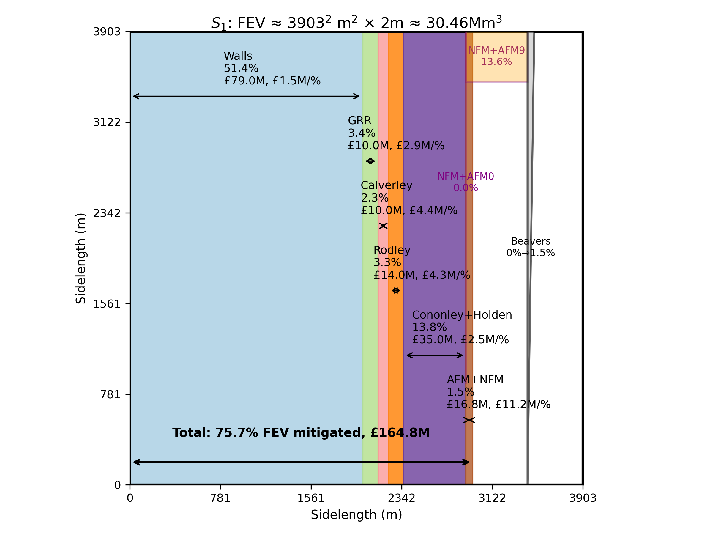
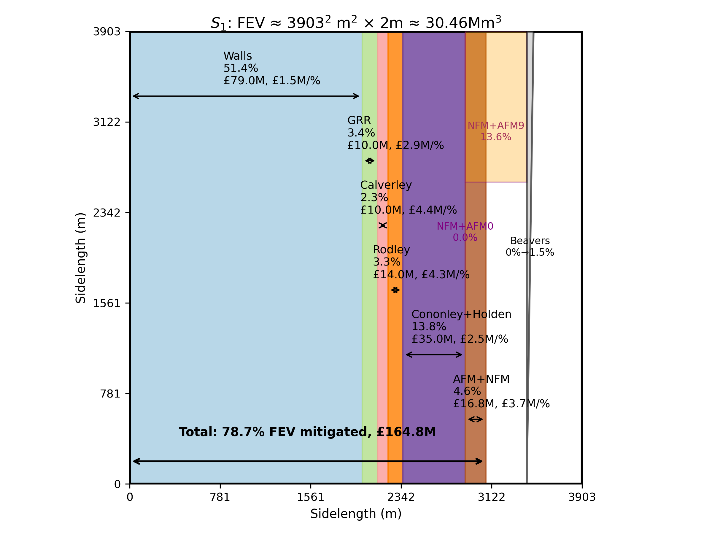

# Environmental Research: Climate Paper (draft)

See call: https://iopscience.iop.org/collections/ercl-250113-756

Below are the instructions to run all codes used and reproduce nearly all figures in the manuscript.

The local parent directory must be set to one's environment in most codes supplied, and discussed below. A subfolder "data" must be created by the user, relative to this code directory. The "Data" folder is one directory up from this code directory and has to exist and contain the relevant and used data files.

## Section on 2015 and 2020 floods and FEV.
Three-panel graphs for 2015 and 2020 River Aire (graphs will be made/placed into a subfolder "data", to be made by the user, relative to the parent directory):
- code: QuadrantandSquarelakeCode.py without GRR; set to Armley2015 or Armley2020 data; "Data" folder is one directory up from this code directory and has to exist and contain the relevant and used data files
- code with GRR rating curve: QuadrantandSquarelakeGRR.py including GRR; set to Armley2015 or Armley2020 data
- Select file, e.g. (line ~48 in first code):
`selected_file = "Armley_2015"`
or
`selected_file = "Armley_2020"`
- The code with GRR rating curve: QuadrantandSquarelakeGRR.py also creates a look-up table of the GRR-rating curve stored under subfolder data in the file "hh_qqq.txt".
- Codes run as: `python3 QuadrantandSquarelakeCode.py` in relevant dirctory; and, as `python3 QuadrantandSquarelakeGRR.py` 

## Section with uplift factors and its table
The cumulative distribution function and extra data for the climate-uplift for the three preiods 2015-2039, 2040, 2069 and 2070-2125 have been generated with the code CDDFup.py (graph made/placed into a subfolder "data").
- Code runs as: `python3 CDFFup.py` with nscenario set (e.g., `nscenario=3` for 2070-2125, et cetera) set for the chosen period.
- The 5th and 30th percentile values added in the Table are created by running through nscenerio=1, 2, 3.

## Section with uplifted three-panel graphs
The uplifts graphs are created using the codes CCL3panel.py and/or CCL3paneGRRl.py:
- choose input file (circa line 47), uplift factor, rating curve error, thresholds, scenario (central, higher central, upper end, at circa line 56) and river-uplift period (set year=2080, e.g., or 2030 or 2050, at circa line 52);
- code CCL3panel.py creates uplift three-panel graph without GRR curve, set figure name near bottom of file (circa line 559);
- code CCL3paneGRRl.py creates uplift three-panel graph with GRR curve and prints various outputs (set figure name near bottom of file at circa line 647);
- code CCL3paneGRRl.py creates printed output for FEV, FEVGRR, plus error bars and such;
- by playing with thresholds in code CCL3paneGRRl.py, several investigations can be made for the cost-effectiveness analyses: see indications on circa lines 66 and 70 .

## Section on respective mitigation measures and cost-effectiveness square-lake plots
Next we select the Armley-2015 data set. For the cost-effectiveness graphs, the respective measures have to be quantified, for which two main codes are used.

For giving-room-to-the-river (GRR):
- case $S_0$, printed output of $FEV_{GRR}=V_{e,GRR}$ follows from QuadrantandSquarelakeGRR.py at ht=3.9; S0-GRR contribution then follows by subtraction as $V_e-V^{(0)}_{e,GRR}$;
- case $S_1$,  printed output of FEV_GRR follows from CCL3paneGRRl.py at ht=3.9; S1-GRR contribution then follows by subtraction as $V_e-V^{(1)}_{e,GRR}$. This can be done for the 23% and 53% uplifts etc.

For higher walls (HW), for case $S_0$:
- Threshold $\hat{Q}_GRR$ found for S0 by hand-shooting with code QuadrantandSquarelakeGRR.py set varying ht such that remainder FEV is found. 
- Two look-up tables created, normal and GRR one, made with  QuadrantandSquarelakeGRR.py named hh_qqqrtnormal.txt and hh_qqqrtGRR.txt
- Used QuadrantandSquarelakeGRR.py by changing ht circa line 56; 14.5% is (0.66+0.7)/9.33 = 10.6%; 20.5% is (0.66+1.26)/9.33 = 20.6%
- walls raised $h_{TGRR}\approx [4.89,4.78]{\rm m}$, plus 0.13m due to current FAS2 to $[5.02,4.91]{\rm m}$..

For S1, now use CCL3paneGRRl.py with ht set at 5.02 yields 14.81Mm^3 as remainder (here I am confused whether I should look at resulting FEV or FEVGRR but likely one can do both, one remainder then does and the other does not include GRR's part):
- so $(30.46-14.81)Mm^3=15.65Mm^3$ due to HW, i.e. 51.4% at 89M pounds;
- so $0.7Mm^3$ by AFPC i.e. 2.3% at 10M pounds;
- so $1Mm^3$ by AFPR i.e. 3.3% at 14M pounds;
- so $4.2Mm^3$ by AFPU 13.78 or 13.8% at 35M pounds;
- then $(14.81-4.2-1-0.7)Mm^3=8.91Mm^3$ is 29% as yet uncovered.

Hence, consider AFM+NFM and AFPB (beavers) which are percentage-wise measure, AFM+NFM at 0% (1/9th) or 9% (8/9)th with mean 1%, and beavers at 1% extra.

The cost-effectiveness graphs are established as follow.

For $S_0$, made with CostEfficacyCodeS0usedtrys.py:
- HW 86.5% to 79.5% at 89M
- AFPC with $0.7{\rm Mm}^3$ to $1.26{\rm Mm}^3$ at 7.5% to 13.5 for 10M
- GRR with $0.66{\rm Mm}^3$ at 7%
- Added GRR+AFPC: 14.5% to 20.5% but we add the extra AFPC beyond the square lake size
- To get effect of beavers run CCL3paneGRRl.py with -1% so (-0.01) as factor to get $V_r=8.98{\rm Mm}^3$, whence $V^{(0)}_{AFPB}=0.35{\rm Mm}^3$.
- To make square-lake effectiveness plot CostEfficacyCodeS0usedtrys.py ("extra", see circa line 144, can be added or not, also in plotting, see circa line 244)

For $S_1$, the situation is more complicated, made with CostEfficacyCodeS1usedtryss.py:
- the 0% and 9% options need to be deducted from chosen CC-uplift; if 51% then 51% and 42%; similar if 0%, 1%, 9%, 10% if beavers vare aded or not.
- then run CCL3paneGRRl.py to get interim FEVs with those deductions; diffence with uplifted FEV is contribtions of 0%, 1%, 9%, 10%; see circa line 193 for changing effective uplifts and circa line 659 for changing output file name
- calculate fraction of FEV (done in Tables)
- AFPC stays 0.7Mm^3, AFPR is 1.0Mm^3, AFPU is 4.2 Mm^3
- add beavers as extra;
- Nunmbers: (30.46-14.81)Mm^3=15.65Mm^3 due to HW, so 51.4% 89M GRR 1.04Mm^3 at 3.4%; 0.7Mm^3 by AFPC 2.3% 10M; 1Mm^3 by AFPR 3.28% or 3.3% at 14M; 4.2Mm^3 by AFPU 13.78 or 13.8% at 35M; interim (14.81-4.2-1-0.7)Mm^3=8.91Mm^3 is 29% uncovered;
take AFM+NFM as extra 0% to 9% of flow with average 1% flow reduction is 0.46 is 1.5% of FEV; 9% is 4.13Mm^3 at 13.6%;
same for beaver dams at 0%-1%; 0.46Mm^3, see Table with effective uplifts.
- Averaged case with (1/9)th and (8/9)th blocks and beavers can be made by extra=None, see circa line 231.
- Alternatively, averaged case with (1/3)th and (2/3)th blocks and beavers can be made by extra=None, see circa line 231.

For the case $S_1$ wwith an ensemble for AFM+NFM at $(1/9)^{th}$ and $(8/9)^{th}$ with a mean flow reduction of 1%, the code CostEfficacyCodeS1usedtryss.py can be adapated (with relevant values for either one already there but commented out ) to yield the following figure.

  

For the case $S'_1$ with an ensemble for AFM+NFM at $(1/3)^{th}$ and $(2/3)^{th}$ (instead of $(1/9)^{th}$ and $(8/9)^{th}$) with a mean flow reducion of 3% , the code CostEfficacyCodeS1usedtryss.py can be adapated (with relevant values for either one already there but commented out ) to yield the following figure.

  

